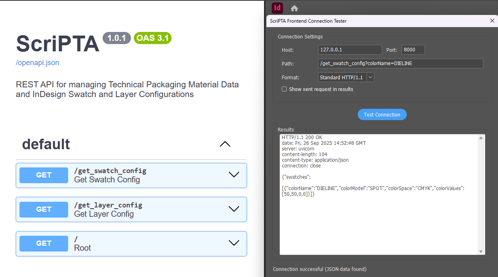
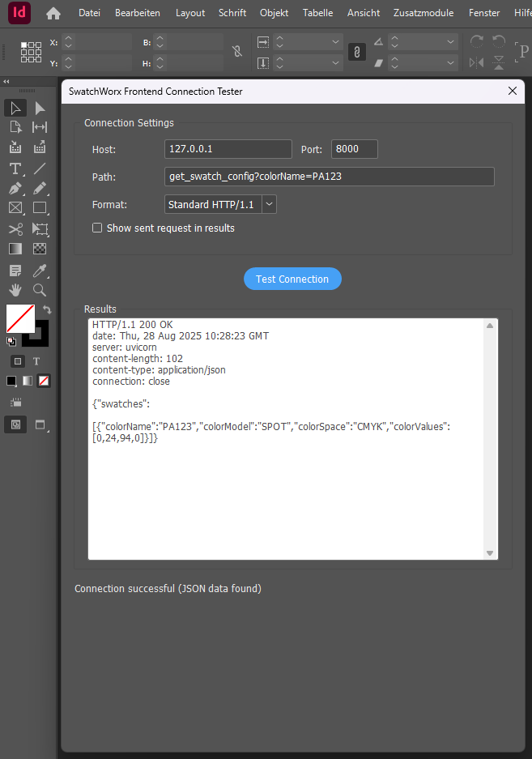

# ScriPTA API


A FastAPI Backend Application that provides Swatch and Layer Configurations to be used in InDesign Scripts.
## Features

- FastAPI backend with basic type safety using Pydantic models
- Endpoints that return swatch and layer configurations
- Optional filtering by color name parameter
- Type definitions using Enums for Color Model and Color Space
- Connection example for Adobe InDesign's ExtendScript

## Installation

1. Set up conda environment:
```bash
conda init
conda create -n scripta python=3.12
conda activate scripta
```

2. Install dependencies:
```bash
pip install -r requirements.txt
```

3. Install development dependencies:
```bash
pip install black isort flake8 mypy
```

4. VSCode Extensions (Recommended):
    - Python (Microsoft) - Core Python support
    - Python Debugger (Microsoft) - Debugging support
    - Pylance (Microsoft) - Language server with IntelliSense
    - Python Environments (Microsoft) - Environment management
    - Black Formatter (Microsoft) - Code formatting
    - isort (Microsoft) - Import sorting
    - Flake8 (Microsoft) - Linting
    - Mypy Type Checker (Microsoft) - Static type checking
    - Prettify JSON (Mohsen Azimi)

## Running the Application

1. Start the development server:
```bash
python -m uvicorn main:app --reload --host 0.0.0.0 --port 8000
```

2. Access the API:
   - API: http://localhost:8000
   - Interactive docs: http://localhost:8000/docs
   - OpenAPI schema: http://localhost:8000/openapi.json

## API Endpoints

### GET /get_swatch_config

Returns swatch configuration data in JSON format. Optionally accepts a `colorname` query parameter to filter results.

**Parameters:**
- `colorname` (optional): Filter results by specific colorname (e.g., "DIELINE", "PA123")

**Examples:**

Get all swatches:
```bash
GET /get_swatch_config
```

Get specific swatch:
```bash
GET /get_swatch_config?colorname=DIELINE
```

**Response format for filtered request:**
```json
{
  "swatches": [
    {
      "colorName": "DIELINE",
      "colorModel": "SPOT",
      "colorSpace": "CMYK",
      "colorValues": [0, 50, 100, 0]
    }
  ]
}
```

**Response format for all swatches:**
```json
{
  "swatches": [
    {
      "colorName": "DIELINE",
      "colorModel": "SPOT",
      "colorSpace": "CMYK",
      "colorValues": [0, 50, 100, 0]
    },
    {
      "colorName": "PA123",
      "colorModel": "SPOT", 
      "colorSpace": "CMYK",
      "colorValues": [50, 50, 50, 50]
    },
    {
      "colorName": "PA321",
      "colorModel": "PROCESS",
      "colorSpace": "CMYK", 
      "colorValues": [40, 40, 40, 40]
    }
  ]
}
```

**Swagger Docs**
- Go to localhost:8000/docs for complete API Documentation

## Project Structure

```
scripta-app/
├── main.py          # FastAPI application and endpoints
├── models.py        # Pydantic models and type definitions  
├── data.py          # Sample swatch data
├── requirements.txt # Python dependencies
└── README.md       # Documentation
```


## Frontend Connection Example for ExtendScript

The ScriPTA API includes an ExtendScript-based connection tool that allows Adobe InDesign users to test API connectivity directly from the InDesign environment.

### Overview

This tool provides a simple UI for testing HTTP connections from InDesign to the FastAPI backend running locally or on a network server. It demonstrates how InDesign can communicate with external web services using ExtendScript's Socket functionality.

### Installation

1. Save the `frontend.jsx` script to your InDesign Scripts folder:
   ```
   C:\Users\{USERNAME}\AppData\Roaming\Adobe\InDesign\Version 20.0\de_DE\Scripts\Scripts Panel
   ```
   
2. In InDesign, access the script from:
   - German UI: Fenster > Hilfsprogramme > Skripte
   - English UI: Window > Utilities > Scripts

### Using the Test Tool

1. Launch the script from InDesign's Scripts panel
2. Configure connection settings:
   - Host: Default is `127.0.0.1` for local development
   - Port: Default is `8000` for the FastAPI development server
   - Path: The API endpoint to test, including query parameters
   
3. Example paths to test:
   ```
   /get_swatch_config                    # Get all swatches
   /get_swatch_config?colorName=PA123    # Get specific swatch
   /get_layer_config?configName=default  # Get layer configuration
   ```

4. Click "Test Connection" to execute the request and view results

